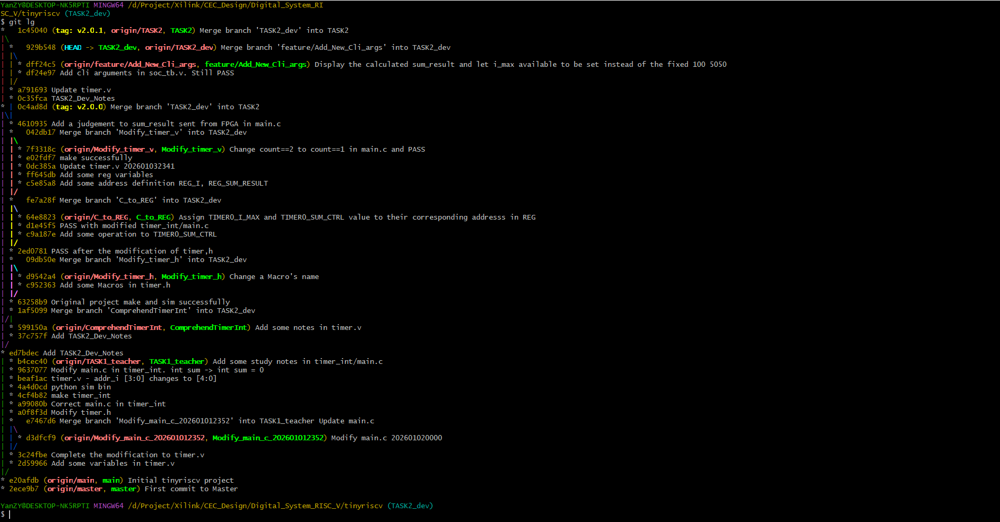

## BIT_CEC_DC_TinyRISCV_full_code


北京理工大学（BIT）电路与电子线路课程设计，信电、集电大三上小学期，数字电路部分，基于Tiny RISC-V修改的累加器完整代码，克隆后可直接编译运行。其中TASK1为软件计算，TASK2为硬件计算。北理工、北理、BIT、Beijing Institute of Technology。信息与电子学院、集成电路与电子学院。2023级，2025-2026学年。

如果您想要完整代码，请克隆 https://github.com/MrYanYe/BIT_CEC_DC_TinyRISCV_full_code 仓库，我已经将我的完整代码上传到上面了。

本代码是基于 liangkangnan/tinyriscv 这个gitee项目修改的，要运行此项目，要先按照 https://gitee.com/liangkangnan/tinyriscv/tree/master/ 里面的教程配置环境并安装相关工具（**```gnu-mcu-eclipse-riscv-none-gcc-8.2.0-2.2-20190521-0004-win64```这个文件夹我已经上传到仓库并放到正确位置了，就不用再从百度网盘下载下来替换我这个仓库里的了**）。

```TASK2_Dev_Notes.md```是我的完成该项目是的一些学习记录。

这个仓库存放的是完整代码，直接克隆下来就能编译运行，不用手动替换单个文件了。并且我修改了原作者的.gitignore，所以bin文件和波形文件也可以直接查看。


我大致基于GitFlow流程开发，也就是main, dev, feature等分支的框架。


最终复现执行用到的主要分支有两个，**Task1_teacher** 和 **TASK2**。因为数字电路RISC-V小学期有两个任务TASK1和TASK2（虽然是任选其一），所以Task1_teacher和TASK2分支分别相当于两个任务的main分支。

TASK1老师会在视频里带着做，很容易完成。所以我设置仓库呈现的**默认分支是TASK2的代码**，下面说的主要也是 TASK2 部分的代码。

### 1. 相对于gitee原项目修改和增加的地方

相对于gitee原项目修改了
```
\tests\example\timer_int\main.c
\tests\example\include\timer.h
\rtl\perips\timer.v
\tests\example\include\utils.h
\tb\tinyriscv_soc_tb.v
```

增加了TASK1和TASK2的bin文件和vcd波形文件，以及```gnu-mcu-eclipse-riscv-none-gcc-8.2.0-2.2-20190521-0004-win64```文件夹，可以直接验证题目要求功能是否实现。

### 2. 实现功能

(1)  将simple例程中的sum累加功能，移植到verilog编写的硬件模块中(例如timer.v)，从	而将软件计算变为硬件计算，cpu配置并启动硬件模块进行sum累加,从1加到100，最终值为5050。
(2)  main.c中要添加对硬件模块内寄存器值的读取功能，实现硬件模块完成sum累加后，通过中断触发cpu读取计算结果并进行校验（对应步骤4）。添加中断功能，实现计算完成后、CPU回读sum结果并校验。
(3)  GTKwave软件中可直接观察到i、sum这两个寄存器的值，从而看到sum循环累加的完整计算过程。
(4)  timer的main.c中添加对sum最终累加值的判断功能，在cmd的仿真命令执行后，能看到pass/fail提示。 

同时，我用通用寄存器的x28定义了新的命令行提示，可以在**命令行显示FPGA算的sum_result**是多少，PASS和FAIL的大字提示也略有改变。在main.c中**把原来固定的i=100 sum=5050改为了可以手动设置i_max**，然后C程序**自动算出**正确的sum_result，再与FPGA传过来的sum_result对比，这样只用修改一个i_max，后面的流程都是自动化的。


### 3. 编译复现流程

#### 3.1 TASK2代码复现

（前提是已经按照gitee原项目部署好了环境，安装了相关工具）

直接克隆下来，放到无中文路径的文件夹下。

TASK2是根据gitee初始项目的 timer_int 计时器中断例程改写的，所以cmd进入```\tests\example\timer_int```文件夹，依次执行执行

```make clean```
```make```

然后进入```\sim```文件夹，执行

```python .\sim_new_nowave.py ..\tests\example\timer_int\timer_int.bin inst.data```

命令行上会出现大的 **SUM PASS**，并会在下面一行显示最终的sum_result是多少，比如

```
~~~~~~~~~~~~~~~~~ SUM_TEST_PASS ~~~~~~~~~~~~~~~~~
~~~~~~~~~~~~~~~~~~~~~~~~~~~~~~~~~~~~~~~~~~~~~~~~~
~~~~~~~~~~~~~  ####   #    #  #    # ~~~~~~~~~~~~
~~~~~~~~~~~~~ #       #    #  ##  ## ~~~~~~~~~~~~
~~~~~~~~~~~~~  ####   #    #  # ## # ~~~~~~~~~~~~
~~~~~~~~~~~~~      #  #    #  #    # ~~~~~~~~~~~~
~~~~~~~~~~~~~ #    #  #    #  #    # ~~~~~~~~~~~~
~~~~~~~~~~~~~  ####    ####   #    # ~~~~~~~~~~~~
~~~~~~~~~~~~~~~~~~~~~~~~~~~~~~~~~~~~~~~~~~~~~~~~~
~~~~~~~~~ #####     ##     ####    #### ~~~~~~~~~
~~~~~~~~~ #    #   #  #   #       #     ~~~~~~~~~
~~~~~~~~~ #    #  #    #   ####    #### ~~~~~~~~~
~~~~~~~~~ #####   ######       #       #~~~~~~~~~
~~~~~~~~~ #       #    #  #    #  #    #~~~~~~~~~
~~~~~~~~~ #       #    #   ####    #### ~~~~~~~~~
~~~~~~~~~~~~~~~~~~~~~~~~~~~~~~~~~~~~~~~~~~~~~~~~~

sum_result      =       5050

```

如果你在main.c里修改了i_max的值，也就是i从1加到多少的值，比如从100改为了10，那么累加和应为55，编译运行后命令行就会显示

```
~~~~~~~~~~~~~~~~~ SUM_TEST_PASS ~~~~~~~~~~~~~~~~~
~~~~~~~~~~~~~~~~~~~~~~~~~~~~~~~~~~~~~~~~~~~~~~~~~
~~~~~~~~~~~~~  ####   #    #  #    # ~~~~~~~~~~~~
~~~~~~~~~~~~~ #       #    #  ##  ## ~~~~~~~~~~~~
~~~~~~~~~~~~~  ####   #    #  # ## # ~~~~~~~~~~~~
~~~~~~~~~~~~~      #  #    #  #    # ~~~~~~~~~~~~
~~~~~~~~~~~~~ #    #  #    #  #    # ~~~~~~~~~~~~
~~~~~~~~~~~~~  ####    ####   #    # ~~~~~~~~~~~~
~~~~~~~~~~~~~~~~~~~~~~~~~~~~~~~~~~~~~~~~~~~~~~~~~
~~~~~~~~~ #####     ##     ####    #### ~~~~~~~~~
~~~~~~~~~ #    #   #  #   #       #     ~~~~~~~~~
~~~~~~~~~ #    #  #    #   ####    #### ~~~~~~~~~
~~~~~~~~~ #####   ######       #       #~~~~~~~~~
~~~~~~~~~ #       #    #  #    #  #    #~~~~~~~~~
~~~~~~~~~ #       #    #   ####    #### ~~~~~~~~~
~~~~~~~~~~~~~~~~~~~~~~~~~~~~~~~~~~~~~~~~~~~~~~~~~

sum_result      =         55

```

#### 3.2 其他分支
如果你想看TASK1的代码或者所有的分支，请在git clone之后执行

```
for branch in $(git branch -r | grep -v '\->'); do
    git branch --track ${branch#origin/} $branch
done
```
一次性把远程分支都建成本地分支，然后使用git checkout <branch_name> 来查看特定分支的代码。

比如查看TASK1代码就是
```git checkout TASK1_teacher```

要查看整个项目的分支树状结构，只需在命令行中执行以下命令

```git log --graph --oneline --all --decorate```


